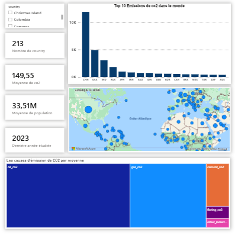

## Description du Dataset étudié : Émissions de CO₂

### Colonnes du dataset

- **country** : Nom du pays.
- **iso_code** : Code ISO du pays (3 lettres).
- **year** : Année de la mesure.
- **population** : Nombre total d’habitants.
- **gdp** : Produit Intérieur Brut du pays (en dollars constants).
- **co2** : Émissions totales de CO₂ (toutes sources confondues).
- **cumulative_co2** : Quantité totale de CO₂ émise historiquement par le pays.
- **co2_per_gdp** : Quantité de CO₂ émise pour une unité de PIB (efficacité carbone).
- **energy_per_capita** : Énergie totale consommée par habitant.
- **energy_per_gdp** : Énergie utilisée pour générer une unité de PIB (efficacité énergétique).

### Émissions par source d’énergie

- **coal_co2** : Émissions de CO₂ provenant du charbon.
- **gas_co2** : Émissions provenant du gaz naturel.
- **oil_co2** : Émissions provenant du pétrole (essence, diesel, etc.).
- **flaring_co2** : Émissions dues au torchage de gaz dans les sites pétroliers.
- **cement_co2** : Émissions dues à la production de ciment.
- **other_industry_co2** : Autres émissions industrielles (processus chimiques, métallurgie, etc.).

### Technologies utilisées :

- **Python** : pour nettoyer et preparer les données.
- **Logiciel de visualisaiton** : Power BI.
---

### Visualisation :

  

